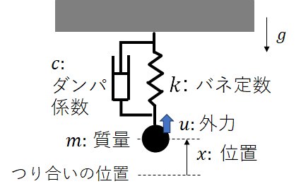
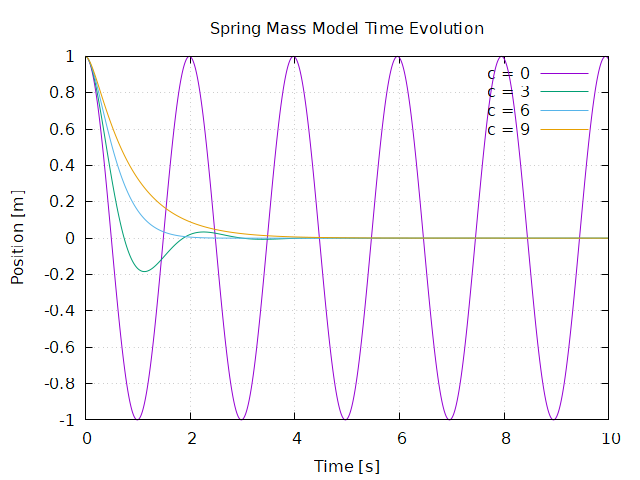

１日目　SLIPモデルを用いたシミュレーションを実現しよう

# 注意事項
本資料をもとに授業を進めます．
本資料に従ってプログラミングをおこない，課題と問について解いてください．（応用課題については，時間を持て余してしまう人だけ解いてください．基本的には課題を解いてもらえれば合格です．）
課題の解答は，レポートにまとめてください．レポートは，実験概要についてまとめた後，各課題についてソースコードと解答を載せてください．（応用課題をやった人はそれも載せてください．加点します．）

# 概要
スライドを用いて説明


# バネダンパ系の運動シミュレーション
練習問題として，バネでつるされた質点の運動を数値的にシミュレーションしながら，これまで学んだ微分方程式の数値解法を復習する．

## 問題設定
図のように重力下(重力加速度: $g$)で天井から質点（質量: $m$）が線形バネ(バネ定数: $k$)とダンパ(ダンパ定数: $c$)で釣られているシステムを考える．
この時，バネのつり合いの位置を原点として，鉛直上向き方向を正とする座標系を定義し，質点の位置を $x$と表す．バネに重りを付けなかった際（自然長時）のバネ先端の位置を $x_n = mg/k$とする．
さらに，質点には任意の外力 $u$も及ぼされるものとする（実際には接触なく外力を与えるのは難しいが，磁気等を使って外力を非接触で制御できると考えることとする）．



このとき，質点に対して時刻 $t=0$で初期位置と速度 $(x_0, \dot{x}_0)$を与えた際に，質点の運動がどのように時間発展するかを数値計算で確かめる．

## 運動方程式の導出
この質点の運動方程式は，ニュートンの運動方程式の導出方法で簡単に導出することができるが，ここではオイラーラグランジュの運動方程式を使った導出法を復習する．
まず，システムの一般化座標 $\bm q$を定義する必要が，ここでは，質点の位置 $x$を一般化座標 $q$として定義する．この時，ラグランジアン $L = T - V$（ $T$: 運動エネルギー, $V$: ポテンシャルエネルギー）は，以下のようにかける．
$$L = \frac{1}{2} m \dot{q}^2 - m g q - \frac{1}{2} k {(x_n - x)}^2$$
また，システムの散逸関数 $D$は，ダンパによる抵抗力を考えて以下でかける．
$$D = \frac{1}{2} c \dot{q}^2 $$
散逸関数は授業で扱われていないかもしれない．散逸関数(スカラー)は，速度のみに依存する抵抗力 $f_i$に対して，$f_i = - \frac{\partial D}{\partial \dot{q_i}}$と定義される( $i$は一般化座標 $\bm q$の要素に対応する)．
もし，システムが，ポテンシャルや散逸関数以外に一般化力を持たなければ，全エネルギー $E$の時間発展は $\frac{dE}{dt} = - D$とかける．つまり，散逸関数の物理的意味は，単位時間あたりに抵抗力により失うエネルギーを表している．

つぎに，このシステムの一般化力 $Q$は，質点にかかる外力である $u$と表すことができる．
以上から，$q_i$に対するオイラーラグランジュ方程式
$$\frac{d}{dt} \frac{\partial L}{\partial \dot{q}_i} - \frac{\partial L}{\partial q_i} = - \frac{\partial L}{\partial \dot{q}_i} + Q_i $$
を用いることで，このシステムの運動方程式は，
$$m \ddot x + c \dot{x} + k {x} = u$$
と導出することができる．
```
問1 上記を実際に計算して確認せよ
```

## 運動方程式の数値解法
多くの場合，運動シミュレーションは微分方程式（運動方程式）を数値的に解くことに帰着される．
今回の問題では， $u$が特定の関数の場合（例えば $u$が時間に依存しない場合など）には解析的に解くことができる（厳密解が導出できる）．
しかし， $u$が任意の時間関数になった場合には，解析的な解を求めるのは難しいことは想像できると思う．
ここでは，２種類の数値解法を用いて，この運動方程式（微分方程式）の時間発展を計算する．

### オイラー法
微分方程式
$$\dot{x} = f(t, x)$$
が与えられた時に，微小時間ステップ $\Delta t$を設定し，時刻 $t+\Delta t$の状態 $x$を
$$x(t+\Delta t) = x(t) + f(t, x)  \Delta t$$
として近似計算する方法．前ステップの値に，時間変化に対する傾き $f(t, x)$ と 時間ステップ $\Delta t$　をかけたものを加えていく計算となっている．
実装は非常に簡単だが，誤差が蓄積しやすいデメリットがある．

### ルンゲクッタ(4次)法
オイラー法はシステムの挙動を点 $(x(t); t)$において線形近似し， $x(t + \Delta t)$ の値を求めたが，テイラー展開を用いるとより詳細な近似が可能になる．
ルンゲクッタ法（4次）は， $x(t+\Delta t)$の4次の項までのテイラー展開と結果が一致するようにした方法である．
テイラー展開するには， $x$の高次の時間微分（ $f(t,x)$の高次時間微分）が必要になるが，それを用いることなく $f(t,x)$のみを使って4次の近似を可能にしたのがルンゲクッタ法である．
詳細には踏み込まないが，計算式は以下である．
$$x(t + \Delta t) = x(t) + \frac{k_1 + 2k_2 + 2k_3 + k_4}{6} \Delta t $$
なお，
$$k_1 = f(t, \, x(t)), \:   k_2 = f(t + \Delta t /2, \, x(t) + k_1 \Delta t /2) , \: k_3 = f(t + \Delta t /2, \, x(t) + k_2 \Delta t /2) ,  \: k_4 = f(t + \Delta t, \, x(t) + k_3 \Delta t) $$
それほど複雑でない計算で，4次の精度を得ることができる．
そのため，ロボットのシミュレーションでは良く用いられる数値計算法である．

## プログラムの実装
上記2つの数値解法を用いて質点の運動の時間発展を求めるが，システムの運動方程式
$$m \ddot x + c \dot{x} + k {x} = u$$
は2階の微分方程式であり，上記で議論した1階の微分方程式に変換する必要がある．
制御工学で学んだように，2階の微分方程式は変数をあらたに増やすことで，1階の微分方程式にできる．本システムの場合は， $y = \dot x$ なる変数を増やすことによって，以下の1階の微分方程式に帰着できる．
$$\frac{d}{dt} \left[\begin{matrix} x \\ y\end{matrix} \right] =  \left[ \begin{matrix} y \\ (- c \dot{x} - k {x} + u ) /  m  \end{matrix} \right]$$
なお，微分方程式で微分される変数（この場合は $(x, y)$）を，制御ではシステムの状態変数と呼んでいた．

```
課題1 オイラー法とルンゲクッタ法を用いて，運動方程式を数値計算するプログラムを書け．なお，外力uは時間のみに依存する関数として，プログラム内で定義しておいてください．また，以下で指定する数値例で解いてみる．
```
### 物理パラメタ等
作成したプログラムを使って，以下の物理パラメタの下，ダンパ係数 $c$を様々に変化させて，システムの応答を確認してみてください． $u(t)=0$としてください．
| 変数 | 値   |   変数 | 値 |
| ------- | --------- | --------- | ------- |
| $m$   | 1 [kg]     |     $x(0)$ |  1 [m]   |
| $k$   | 10 [N/m]    |     $\dot{x}(0)$ |  0 [m]   |
| 刻み幅 $dt$   | 0.01 [s]     |     シミュレ時間 $T$ | 10 [s]   |

ダンパ係数を４種類変化させて（0, 3, 6, 9）， $x$の時間変化のグラフをルンゲクッタ法を用いて作ってください．



これまでの授業で培ってきた直観とあっているでしょうか？

### 課題1のヒント
C++言語の場合を例としてプログラムの構築例を示す．TODOと書かれたところは自分で書いてください．
（特にこのように書けという指示ではないため，プログラミングに慣れた方は自由にコーディングしてください．）

```cpp :example1.cpp
#include <iostream>
#include <cmath>
#include <vector>
#include <fstream>

// 定数の設定
const double g = 9.81;  // 重力加速度 [m/s^2]

// クラスの定義
//  運動方程式の状態量や物理パラメタを管理しており，step_?? 関数を呼び出すことで状態量の時間を１ステップ(dt)進める機能を提供する
class Spring_mass {
private: 
    // メンバ変数
    double m;        // 質量 [kg]
    double k;        // バネ定数 [N/m]   
    double c;        // ダンパ係数 [Ns/m]  
    double x;        // 位置 [m]  　　＊時間とともに変化します．
    double dx;       // 速度 [m/s]　　＊時間とともに変化　
    double t;     // 時間 [s]　＊時間とともに変化

public:
    // コンストラクタ -- 変数を初期化する
    //  初期時間はゼロとしている
    //   m(m_) は，メンバ変数 m を m_ で初期化するという文法です．他も同様
    Spring_mass(double m_, double k_, double c_, double x_, double dx_) : m(m_), k(k_), c(c_), x(x_), dx(dx_), t(0.){}

    // 制御入力の計算式
    double func_u(double t){
        return 0.;
    }

    // 時間発展の方程式
    double func_dx(double t_, double x_, double dx_){
        // ここにdx/dt の時間発展の式を書く (dx/dt)
        return TODO; 
    }
    double func_ddx(double t_, double x_, double dx_){
        // ここにddx / ddt 時間発展の式を書く (dy/dt)
        return TODO;
    }

    // 1ステップ計算させる
    // euler法
    void step_euler(double dt) {
        TODO
    }

    // Runge kutta法
    void step_rk4(double dt) {
        TODO
    }

    // データを取り出す
    double get_x(){
        return x;
    }
    double get_dx(){
        return dx;
    }
    double get_t(){
        return t;
    }
    double get_u(){
        return func_u(t);
    }
};

int main() {
    // パラメータの設定
    double m = 1.;           // 質量 [kg]
    double k = 10.;           // バネ定数 [N/m]   
    double c = 1.;           // ダンパ係数 [Ns/m]  

    double ini_x = 1.;        // 初期位置 [m]
    double ini_dx = 0.;       // 初期速度 [m/s]
    
    double dt = 0.01;            // タイムステップ [s]
    double total_time = 10.0;    // 総計算時間 [s]

    Spring_mass spring_mass(m, k, c, ini_x, ini_dx); // 上で作ったクラスを呼び出す

    std::ofstream ofs("data_runge.dat"); // データを保存するためのファイルを開く

    for (double t = 0.; t < total_time; t += dt) { // 毎ステップ，微分方程式を数値的に解く
        ofs << spring_mass.get_t() << ", " << spring_mass.get_x()  << ", " << spring_mass.get_dx() << std::endl;  // 時間と状態量をクラスから読み出し，ファイルに保存  　ファイルへの保存の仕方はC言語よりも直観的だと思います． std::endl で改行されます．
        spring_mass.step_rk4(dt); // ルンゲクッタ法のstep関数を呼び出して，時間と状態量を次のステップに進める
    }

    ofs.close();  // ファイルを閉じる

    std::cout << "Calculation completed and data has been saved -- sim duration is " << total_time << " [s]" << std::endl; // こんな感じでコンソールにメッセージを出せます．デバッグに活用してください．

    return 0;
}

```

得られた結果の時間データは，グラフにプロットしないと良く分からない．グラフ作成には様々なツールが存在し，何をつかっても構わない．
ここでは，gnuplotを使った場合のプログラムの一例を示す．
```plaintext
# プロットの設定
set title "Spring Mass Model Time Evolution"
set xlabel "Time [s]"
set ylabel "Position [m]"
set grid

# データのプロット
plot "data_test.dat" using 1:2 with lines title "x(t) from Euler"
replot "data_runge.dat" using 1:2 with lines title "x(t) from RK4"


# グラフを保存
set terminal pngcairo
set output "test_plot.png"
replot

# プロットを画面に表示
pause mouse
```

## プログラムの妥当性の検証
実装したプログラムがうまく動いているか，バグがないかを調べる必要がある．
微分方程式の解析解は求まらない場合がほとんどのため，この検証は難しい場合が多い．
今回に限っては， $u=0, c=0$の時には解析的に解を導出可能であるため，それと比較することでプログラムを検証する．

$u=0, c=0$の場合の一般解は，以下のように求めることができます．
$$
x = a \cos (\omega t + \phi)
$$
なお， $\omega$は， $m,k$を用いて表すことができ， $a, \phi$は初期状態に応じて決まる量である．
```
問2 上記を実際に計算して，シミュレーション条件での解を求めてください．
```
```
応用課題1 ダンパが存在する場合でも解析解は求めることができる．解析解を求め，シミュレーションと比較してみてください．
```
<!-- omega = \sqrt(k / m) , a = 1, phi = 0 -->

プログラムの妥当性を確認する方法は様々なやり方が考えられる．
おそらく，一番簡単なやり方は，真値とオイラー法，ルンゲクッタ法の時間発展を実際にプロットして，ルンゲクッタ法が真値からずれないことを定性的に確認する事だと考えられる．
```
課題2 u=0, c=0, シミュレーション時間 50[s] dt = 0.2[s]（それ以外は課題１と同じ条件）において，位置xの時間変化を，真値とオイラー法，ルンゲクッタ法とで比較してみてください．
また，相図（横軸縦軸を状態空間の(x,y)にしたもの）でも確かめてください．
```

しかし，このやり方では，定性的にプログラムがあっていそうなことは確かめられても，定量的にあっているのかは良く分からない．
数値計算である以上，真値とずれが生じるが，そのずれが定量的に妥当なものなのかが評価できていません．
そこで，ここでは以下のように，位置に対して１[s]後の絶対誤差$e$を定義し，この誤差が$dt$を変えた時にどのように小さくなっていくかをもとに，プログラムの妥当性を定量的に評価する．
$$e_{\Delta t} =  | \~{x}_{\Delta t}(1) - \hat{x}(1) |$$
なお， $\~{x}_{\Delta t}$は，オイラー法またはルンゲクッタ法で $\Delta t$刻みで計算した位置であり， $\hat{x}$は真値であるとする．

```
課題3 絶対誤差 e が，dt に対してどのように変化するかを両対数グラフで示せ（オイラー法とルンゲクッタ法それぞれについて）．なお，シミュレーションの初期値や物理パラメタ等は，課題1と同じものをもちいて構わない．(なお，u=c=0)．オイラー法やルンゲクッタ法の精度をもとに，プログラムが妥当であるかどうかについて考察してみてください．

また，dtを小さくしてもeの精度が良くならなくなる場合があると思いますが，その理由も考えてみてください．
```
ヒント：　これは少し難しい課題だと思います．ルンゲクッタが理論通りの高精度になるかどうかは，正確なプログラムがかけてないと難しいです．ルンゲクッタの精度がオイラー程度しか出ない場合，次をチェックしてください．評価をおこなう時刻（今回は  $t=1$ [s]）がプログラム上で正確か？（サンプルプログラムは，終了時間について雑に作ってますので，注意してください）．また，時刻の精度は $\Delta t$の取り方（時刻が $\Delta t$で割り切れるか？）にも依存しますので，注意してください．

## 強制振動の分析
$c \neq 0$ の場合，時間とともに振動はなくなってしまうが，
 $u(t) = \sin ( \hat{\omega} t)$ のように，周期外力を加えたものは振動を続けることが知られている（強制振動）．そして，強制入力項の振動数がある特定の値になった際に，振動の振幅が大きくなる（共鳴）することが知られている．
```
応用課題2 上記を実際に確かめてみてください．様々な周波数で振動を加えて，時間とともに定常振動になることを確かめてください．また，周波数に応じて定常振動の振幅がどのように変化するかを調べてください．（横軸周波数，縦軸振幅としたグラフを書くと，よくわかります．）
```

# SLIPモデルのシミュレーション
