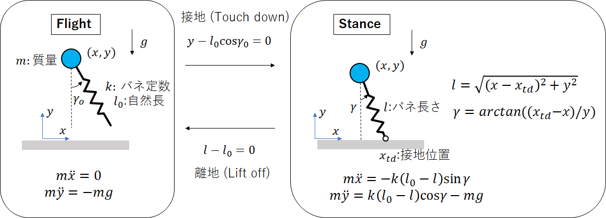
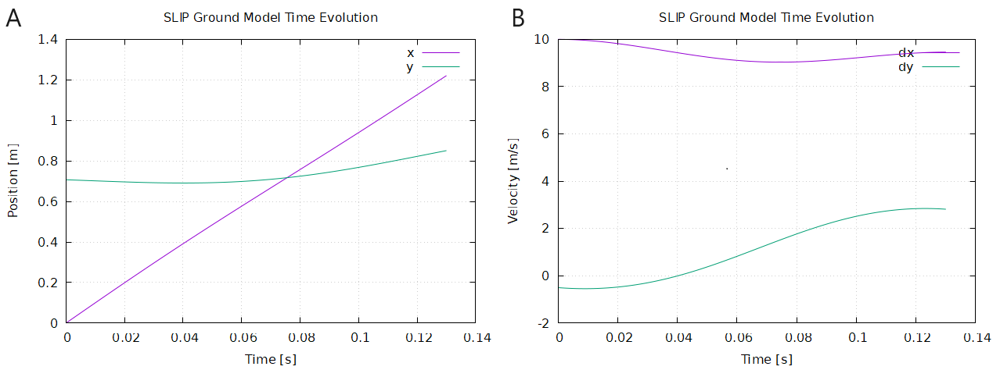
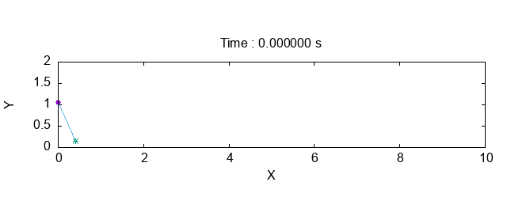

2-3日目　SLIPモデルを用いたシミュレーションを作ろう 

# 注意事項
本資料をもとに授業を進めます．
本資料に従ってプログラミングをおこない，課題と問について解いてください．（応用課題については，すべての課題を終えた人だけ解いてください．基本的には課題を解いてもらえれば合格です．）
課題の解答は，レポートにまとめて提出していただきます．詳細は[ReadMe](https://github.com/amby-1/sogoenshu_2023/blob/main/README.md)をよく読んで下さい．

# 2-3日目の目標
１日目に学習した運動方程式の数値解法を応用して，いよいよSLIPモデルのシミュレータ作成に取り組みます．
２日目の終わり地点で，SLIPモデルのStance，Flight相それぞれのプログラムは完成させてください（課題1-3を終わらす）．

その場ジャンプ(課題4の途中)までが実現できていれば３日目が楽になります．

# SLIPモデル


SLIPモデルは，図のように質点と質量のないバネ（脚）が連結された保存系のシステムであり，脚が浮いている Flight phase（浮遊相）と，脚が地面に接地している Stance phase（接地相） の2つの運動フェーズを持つ．
Flight phase では，質点は放物運動をおこない，バネの姿勢は接地角 $\gamma_o$を保つ，一方で，足先が地面に接地するとStance phase に切り替わり，足先は地面に固定されたピンジョイントとしてふるまう．
Stance phase 内で，バネの長さが自然長になったら離地してFlight phase に戻るとともに，バネの角度を接地角 $\gamma_o$に戻して放物運動を再び行う．これらの2つの相の運動を繰り返し続ける．

## 運動方程式の導出



この質点の運動方程式は，ニュートンの運動方程式の導出方法で簡単に導出することができる．
上図のように，座標系と変数を定義する．質量 $m$，バネ定数 $k$，自然長 $l_0$，重力加速度 $g$と定義し，質点の位置を $(x, y)$と表す．また，Stance相での足先の接地座標を $x_{td}$とする．
この時，Flight phase の運動方程式は以下でかけ，
```math
m \ddot x  = 0,  m \ddot{y} = -mg
```
Stance phase での運動方程式は以下で書ける．
```math
m \ddot x  = - k (l_0 - l) \sin \gamma,  m \ddot{y} = k(l_0 - l)\cos \gamma - mg
```
なお，接地相でのバネの長さ $l$と 脚の角度 $\gamma$は以下であらわされる．
$$l = \sqrt{(x-x_{td})^2 + y^2}, \gamma = \arctan ( (x_{td} - x) / y)$$ 

Flight相からStance相への切り替わりは，足先が空中から地面に接地した時に起き，この時に脚が接地する条件 $y - l_0 \cos \gamma_o = 0$を満たす．
Stance相からFlight相への切り替わり条件は，バネの長さが自然長となった際であり，条件 $l - l_0 = 0$を満たす．
（なお，この部分はあえて厳密な条件式を示していない．プログラミングするときに良く考えてほしい．）

```
問1 上記の運動方程式を実際に自分で導出し，正しいことを確かめよ
```

# 数値シミュレーション実装
上記の運動方程式を数値的に解くことを目指す．バネダンパ系の練習問題と同様に，運動方程式を1階の微分方程式に変換し，ルンゲクッタ法等の数値計算法を用いて解けば良い．
```
課題1 上記のそれぞれの相の運動方程式を，1階の微分方程式に変換せよ．
今回は一般化座標が2変数であることに注意すること．
```

前回と同様に運動方程式を数値的に解くことを目指すが，今回はFlight と Stance で運動方程式が異なり，さらに地面の接地や離地を判断して方程式を切り替える必要がある．
(1)Flightのみ（課題２），(2)Stanceのみ（課題３），(3)切り替わりも含めた実装（課題４）　と，順を追ってプログラムを実装する．

## 課題2,3のサンプルプログラム（Flight，Stanceのみの場合）
課題2,3のサンプルプログラムを示す．C++の場合とC言語の場合の２通りを提示するので，好きなほうを参考にすること．
もちろん，自分で一から作成しても構わない．プログラムの空欄部分については，次節以降をよく読んで，課題に沿って順に実装していくこと．

### C++言語 サンプル
```c++
#include <iostream>
#include <cmath>
#include <vector>
#include <fstream>

// 定数の設定
const double g = 9.8;  // 重力加速度 [m/s^2]

// クラスの定義
//  SLIPモデルの運動方程式の状態量や物理パラメタを持っており，step関数を呼び出すことで状態量の時間を１ステップ(dt)進めることができる
class SLIP{
private:
    // ここにクラスの内部変数を定義する．
    //  この内部変数は，クラス内の関数から自由に変更することができる．

    // 物理パラメタ
    double m;        // 質量 [kg]
    double k;        // バネ定数 [N/m]
    double l0;        // バネの自然長 [m]

    // 状態量
    double x;        // x 位置 [m]
    double dx;       // dx 速度 [m/s]
    double y;        // y 位置 [m] 
    double dy;       // dy 速度 [m/s] 
     
    // 制御パラメタ
    double gamma0;    //　脚の接地角 [rad]

    double x_td;    // 地面に接地している脚の場所 [m] 

    double t;     // 時間 [s]

public:
    // コンストラクタ -- 変数を初期化する
    //  初期時間はゼロとしている
    SLIP(double m_, double k_, double l_, double gamma_) : m(m_), k(k_), l0(l_), gamma0(gamma_), x(0), dx(0), y(1), dy(0), t(0.), x_td(0.){}

    // 初期値設定　（時間０における，各変数の値を設定する）
    double set_iniVal(double x_, double dx_, double y_, double dy_, double gamma_, double x_td_){
        x = x_;
        dx = dx_;
        y = y_;
        dy = dy_;
        t = 0.;

        gamma0 = gamma_;
        x_td = x_td_;
    }

    // フライト相での時間発展の方程式　dx = f(t, x)
    //  １日目のように書くと，関数が４つ必要になってしまうので，ここでは 配列 x[4] = [x, y, dx, dy] を参照するように変更
    void func_dx_flight(double t_, double x_[], double ans_dx_[]){// フライト時の微分方程式の右辺
        // t_: 時間
        // x_[4]: 関数ｆの引数 (x[4] = [x, y, dx, dy])
        // ans_dx_[4] : 関数ｆの返り値 (ans_dx_[4] = [dx, dy, ddx, ddy])
        //  *配列はポインタとして参照している．良く分からない人はＣ言語の配列と関数を復習してください．
        double dx_  = 0.;  // <課題２ TODO>
        double ddx_ = 0.;  // <課題２ TODO>
        double dy_  = 0.;  // <課題２ TODO>
        double ddy_ = 0.;  // <課題２ TODO>

        ans_dx_[0] = dx_;
        ans_dx_[1] = dy_;
        ans_dx_[2] = ddx_;
        ans_dx_[3] = ddy_;       
        return;
    }

    // 接地相での時間発展の方程式　dx = f(t, x)
    //  １日目のように書くと，関数が４つ必要になってしまうので，ここでは 配列 x[4] = [x, y, dx, dy] を参照するように変更
    void func_dx_ground(double t_, double x_[], double ans_dx_[]){// 接地時の微分方程式の右辺
        // t_: 時間
        // x_[4]: 関数ｆの引数 (x[4] = [x, y, dx, dy])
        // ans_dx_[4] : 関数ｆの返り値 (ans_dx_[4] = [dx, dy, ddx, ddy])
        //  *配列はポインタとして参照している．良く分からない人はＣ言語の配列と関数を復習してください．

        // <課題３　TODO>
        return; 
    }

    // 1ステップ計算させる
    // Runge kutta法 Flight 相　
    void step_rk4_flight(double dt) {
        // <課題2 TODO>
        double k1[4], k2[4], k3[4], k4[4];
        double xs[4], tmp_xs[4];
        xs[0] = x;
        xs[1] = y;
        xs[2] = dx;
        xs[3] = dy;

        // ヒント
        func_dx_flight(t, xs, k1);
        // TODO 後は自分で記載すること．
            
        x += 0; // 自分で書くこと　TODO
        y += 0;
        dx += 0;
        dy += 0;
        t += dt;
    }

    // Runge kutta法 Stance相
    void step_rk4_ground(double dt) {
        // <課題3 TODO>   
    }

    // 現在のデータを取り出す
    double get_x(){ // x座標　を返す
        return x;
    }
    double get_dx(){ // dx/dt 速度を返す
        return dx;
    }
    double get_y(){ // y座標を返す
        return y;
    }
    double get_dy(){ // dy/dt を返す
        return dy;
    }
    double get_gamma(){ // 脚の角度 gamma を返す
        // <TODO 課題に応じてそれぞれ実装> クラスの内部変数を使って表しましょう
        return 0.;
    }
    double get_l(){ // 脚の長さ l を返す
        // <TODO 課題に応じてそれぞれ実装> クラスの内部変数を使って表しましょう
        return 0.;
    }
    int get_is_contact(){ // 脚が接地してるかどうかを返す
        // <TODO 課題に応じてそれぞれ実装> 
        return 0;
    }
    double get_t(){ // 時間を返す
        return t;
    }
    double get_E(){ // エネルギーを計算する関数
        return (m*dx*dx + m*dy*dy)/2. + m*g*y + k*(get_l() - l0)*(get_l() - l0)/2.;
    }
};

int main() {
    // パラメータの設定
    double m = 1.;           // 質量 [kg]
    double k = 200.;           // バネ定数 [N/m]   
    double l0 = 1;           // 自然長 [m]  
    double gamma0 = 0.;      // 接地時の角度 [rad]
    
    double dt = 0.001;         // タイムステップ [s]
    double total_time = 1;    // 総計算時間 [s]

    std::ofstream ofs("data_flight.dat"); // データを保存するためのファイルを開く

    // クラスの実体を定義
    SLIP slip(m, k, l0, gamma0);
    // シミュレーションの初期値を代入
    // set_iniVal(double x_, double dx_, double y_, double dy_, double gamma_, double x_td_)
    slip.set_iniVal(0, 5., 4.9, 0., 0.43017, 0.);

    for (double t = 0.; t < total_time; t += dt) { // 毎ステップ，微分方程式を数値的に解く
        ofs << slip.get_t() << ", " << slip.get_x()  << ", " << slip.get_y() << ", " << slip.get_dx()  << ", " << slip.get_dy() << ", " << slip.get_gamma()  << ", " << slip.get_l() << ", " << slip.get_E() << ", " << slip.get_is_contact() << std::endl;  // 時間と状態量をクラスから読み出し，ファイルに保存  　ファイルへの保存の仕方はC言語よりも直観的だと思います． std::endl で改行されます．
        slip.step_rk4_flight(dt); // ルンゲクッタ法のstep関数 (Flight) を呼び出して，時間と状態量を次のステップに進める 
    }
    // 最後の時間に対応するものを出力
    ofs << slip.get_t() << ", " << slip.get_x()  << ", " << slip.get_y() << ", " << slip.get_dx()  << ", " << slip.get_dy() << ", " << slip.get_gamma()  << ", " << slip.get_l() << ", " << slip.get_E() << ", " << slip.get_is_contact() << std::endl;

    ofs.close();  // ファイルを閉じる

    std::cout << "Calculation completed and data has been saved" << std::endl;

    return 0;
}
```

### C言語 サンプル
```c
#include <stdio.h>
#include <math.h>
#include <stdbool.h>

// 定数の定義
const double g = 9.8;  // 重力加速度 [m/s^2]

// グローバル変数の定義
// 物理パラメタ
double m;        // 質量 [kg]
double k;        // バネ定数 [N/m]
double l0;        // バネの自然長 [m]

// 状態量
double x;        // x 位置 [m]
double dx;       // dx 速度 [m/s]
double y;        // y 位置 [m] 
double dy;       // dy 速度 [m/s] 
    
// 制御パラメタ
double gamma0;    //　脚の接地角 [rad]
// 地面に接地している脚の場所 [m] 
double x_td;

double t;     // 時間 [s]

// 初期値設定
void set_iniVal(double x_, double dx_, double y_, double dy_, double gamma_, double x_td_){
    x = x_;
    dx = dx_;
    y = y_;
    dy = dy_;
    t = 0.;

    gamma0 = gamma_;
    x_td = x_td_;
    return;
}

// フライト相での時間発展の方程式　dx = f(t, x)
//  １日目のように書くと，関数が４つ必要になってしまうので，ここでは 配列 x[4] = [x, y, dx, dy] を参照するように変更
void func_dx_flight(double t_, double x_[], double ans_dx_[]){// フライト時の微分方程式の右辺
    // t_: 時間
    // x_[4]: 関数ｆの引数 (x[4] = [x, y, dx, dy])
    // ans_dx_[4] : 関数ｆの返り値 (ans_dx_[4] = [dx, dy, ddx, ddy])
    //  *配列はポインタとして参照している．良く分からない人はＣ言語の配列と関数を復習してください．
    double dx_  = 0.;  // <課題２ TODO>
    double ddx_ = 0.;  // <課題２ TODO>
    double dy_  = 0.;  // <課題２ TODO>
    double ddy_ = 0.;  // <課題２ TODO>

    ans_dx_[0] = dx_;
    ans_dx_[1] = dy_;
    ans_dx_[2] = ddx_;
    ans_dx_[3] = ddy_;       
    return;
}

// 接地相での時間発展の方程式　dx = f(t, x)
//  １日目のように書くと，関数が４つ必要になってしまうので，ここでは 配列 x[4] = [x, y, dx, dy] を参照するように変更
void func_dx_ground(double t_, double x_[], double ans_dx_[]){// 接地時の微分方程式の右辺
    // t_: 時間
    // x_[4]: 関数ｆの引数 (x[4] = [x, y, dx, dy])
    // ans_dx_[4] : 関数ｆの返り値 (ans_dx_[4] = [dx, dy, ddx, ddy])
    //  *配列はポインタとして参照している．良く分からない人はＣ言語の配列と関数を復習してください．

    // <課題３　TODO>
    return; 
}

// 1ステップ計算させる
// Runge kutta法 Flight 相　
void step_rk4_flight(double dt) {
    // <課題2 TODO>
    double k1[4], k2[4], k3[4], k4[4];
    double xs[4], tmp_xs[4];
    xs[0] = x;
    xs[1] = y;
    xs[2] = dx;
    xs[3] = dy;

    // ヒント
    func_dx_flight(t, xs, k1);
    // TODO 後は自分で記載すること．
        
    x += 0; // 自分で書くこと　TODO
    y += 0;
    dx += 0;
    dy += 0;
    t += dt;
}

// Runge kutta法 Stance相
void step_rk4_ground(double dt) {
    // <課題3 TODO>   
}

double get_gamma(){
    // 課題に応じて実装
}
double get_l(){
    // 課題に応じて実装
}
double get_E(){
    // エネルギーの計算
    return (m*dx*dx + m*dy*dy)/2. + m*g*y + k*(get_l() - l0)*(get_l() - l0)/2.;
}

int main() {
    // パラメータの設定
    m = 1.;           // 質量 [kg]
    k = 200.;           // バネ定数 [N/m]   
    l0 = 1;           // 自然長 [m]  
    gamma0 = 0.;
    
    double dt = 0.001;         // タイムステップ [s]
    double total_time = 1.;    // 総計算時間 [s]

    FILE *ofs = fopen("data_flight.dat", "w");  // ファイルを書き込みモードで開く

    set_iniVal(0, 5., 4.9, 0., 0.43017, 0.); // 初期化する

    for (double t = 0.; t < total_time; t += dt) { // 毎ステップ，微分方程式を数値的に解く
        fprintf(ofs, "%f, %f, %f, %f, %f, %f, %f, %f, %d\n", 
                t, x, y, dx, dy, get_gamma(), get_l(), get_E(), 0);
        step_rk4(dt); // ルンゲクッタ法のstep関数を呼び出して，時間と状態量を次のステップに進める
    }
    // 最後の時間に対応するものを出力
    fprintf(ofs, "%f, %f, %f, %f, %f, %f, %f, %f, %d\n", 
                t, x, y, dx, dy, get_gamma(), get_l(), get_E(), 0);
    fclose(ofs);  // ファイルを閉じる

    printf("Calculation completed and data has been saved\n");

    return 0;
}
```
なお，分かりやすさを重視して作成したためグローバル変数を多用しているが，実際にはあまり好ましくない．
グローバル変数は，関数内だろうが，メイン関数内だろうが，どこでもいじれてしまうので，どこで変数がいじられているかが分からなくなってバグの温床になる．あくまでも参考程度にすること．

## Flight相の運動方程式
```
課題2-1 ルンゲクッタ法を用いて，Flight相のみの運動方程式を数値計算するプログラムを書け．
```

```
課題2-2 課題2-1で作成したプログラムを用いて，以下のパラメタでプログラムを実行してみよ．
(x, y, dx/dt, dy/dt)の時間変化のグラフをそれぞれ示せ．
```
以下のパラメタを設定し，初期位置 $x = 0, y=4.9$ 初期速度 $\dot x = 5, \dot y = 0$ を与えてシミュレーションを回してみよ．
| 変数 | 値   |   変数 | 値 |
| ------- | --------- | --------- | ------- |
| $m$   | 1 [kg]     |     $l_0$ |  1 [m]   |
| $k$   | 200 [N/m]    |     $g$ |  9.8 [m/s^2]   |
| 刻み幅 $dt$   | 0.001 [s]     |     シミュレ時間 $T$ | 1 [s]   |

ちゃんと放物運動になっているでしょうか？

```
課題2-3 放物運動については解析解を求めることができる．
(x, y)の時間変化を解析解とグラフで比較し，プログラムが正しいことを確認せよ.
1s 後の時間でのおよその誤差のオーダーは評価すること(10^-12程度になるはずである)
```

```
応用課題1 1[s]後の(x, y)座標の真値との誤差が，刻み幅dtとともにどのように変化するかを両対数グラフで示せ．
今回も4次の精度になっているだろうか？
```

## Stance相の運動方程式
```
課題3-1 ルンゲクッタ法を用いて，Stance相のみの運動方程式を数値計算するプログラムを書け．
```
＊注意：課題２で作ったプログラムは，レポート提出や，バグ発生時に立ち戻るために，別途保存しておくようにしましょう．

```
課題3-2 課題3-1で作成したプログラムを用いて，以下のパラメタでプログラムを実行してみよ
(x, y, dx/dt, dy/dt)の時間変化のグラフを示せ．
```
以下のパラメタを設定し，初期位置 $x = 0, y= 1/\sqrt{2}$ 初期速度 $\dot x = 10, \dot y = -0.5$ 接地角 $\gamma_0 = \pi/4$，接地位置 $x_{td} = 1/\sqrt{2}$を与えてシミュレーションを回してみよ．
| 変数 | 値   |   変数 | 値 |
| ------- | --------- | --------- | ------- |
| $m$   | 1 [kg]     |     $l_0$ |  1 [m]   |
| $k$   | 200 [N/m]    |     $g$ |  9.8 [m/s^2]   |
| 刻み幅 $dt$   | 0.001 [s]     |     シミュレ時間 $T$ | 1 [s]   |

例えば，$(x, y)$ $(\dot{x}, \dot{y})$ の時間変化は以下のグラフのようになっているはずである．



この運動方程式の解は解析的に求めることができない（意外だと思いますが．．．）．そのため，前回のような方法で妥当性を検証することはできない．
そこで，ここではシステムのエネルギーが保存することに着目してシミュレーションの妥当性を検証する．
```
課題3-3 1s 後のエネルギーの時間変化量を計算し，エネルギーが保存されていることを確認せよ
エネルギーの時間変化量が 10^-10 程度になるはずである．
```

```
応用課題2 課題3-3に関連して，1s後のエネルギーの時間変化量が，刻み幅dtとともにどのように変化するかを両対数グラフで示せ．
今回も4次の精度になっているだろうか？
```

## 切り替わりの実装
実際のシミュレーションでは，脚の接地状況に応じてFlight と Stance の切り替わりを判別し，運動方程式を切り替える必要がある．
上記課題でそれぞれの相におけるプログラムは完成したので，それぞれの相の切り替えを実装してシミュレーションを作る．
方針が立たない場合，やることが分からない場合，教員やＴＡに遠慮なく相談してください．
```
課題4-1 SLIPモデルの運動方程式（相の切り替わりも実装）を数値計算するプログラムを書け．
```

＊この課題は難しいと思うのでゆっくり腰を据えて取り組んでください．以下にサンプルプログラムを示します．変数等は自由に追加して結構です．

＊注意：課題2,3で作ったプログラムは，レポート提出や，バグ発生時に立ち戻るために，別途保存しておくようにしましょう．

## 課題４のサンプルプログラム（SLIPモデル）
課題4のサンプルプログラムを示す．C++の場合とC言語の場合の２通りを提示するので，好きなほうを参考にすること．
なお，接地判定のために，クラス内部の変数やグローバル変数は自分で増やしたりしてかまわない．（むしろ必要）
もちろん，自分で一からプログラムを作成しても構わない．

### C++言語 サンプル
```c++
#include <iostream>
#include <cmath>
#include <vector>
#include <fstream>

// 定数の設定
const double g = 9.8;  // 重力加速度 [m/s^2]

// クラスの定義
//  SLIPモデルの運動方程式の状態量や物理パラメタを持っており，step関数を呼び出すことで状態量の時間を１ステップ(dt)進めることができる
class SLIP{
private:
    // ここにクラスの内部変数を定義する．
    //  この内部変数は，クラス内の関数から自由に変更することができる．

    // 物理パラメタ
    double m;        // 質量 [kg]
    double k;        // バネ定数 [N/m]
    double l0;        // バネの自然長 [m]

    // 状態量
    double x;        // x 位置 [m]
    double dx;       // dx 速度 [m/s]
    double y;        // y 位置 [m] 
    double dy;       // dy 速度 [m/s] 
     
    // 制御パラメタ
    double gamma0;    //　脚の接地角 [rad]
    // 地面に接地しているかのフラグ [bool]
    bool is_contact; // 
    // 地面に接地している脚の場所 [m] 
    double x_td;
    // 他に追加したい変数があれば，ここに変数として定義すればいい
    int dummy; // 例として　dummy という変数を決める

    double t;     // 時間 [s]

public:
    // コンストラクタ -- 変数を初期化する
    //  初期時間はゼロとしている
    SLIP(double m_, double k_, double l_, double gamma_) : m(m_), k(k_), l0(l_), gamma0(gamma_), x(0), dx(0), y(1), dy(0), t(0.){}

    // 初期値設定
    void set_iniVal(double x_, double dx_, double y_, double dy_, double gamma_, bool is_contact_, double x_td_){
        x = x_;
        dx = dx_;
        y = y_;
        dy = dy_;
        t = 0.;

        gamma0 = gamma_;
        is_contact = is_contact_;
        x_td = x_td_;

        // 追加した変数があれば，ここで初期化する
        dummy = 0; // 例として　dummy という変数を示しておく
    }

    // 時間発展の方程式
    // フライト相での時間発展の方程式　dx = f(t, x)　
    //   配列 x[4] = [x, y, dx, dy] を参照するように変更
    //   課題２で作った関数と同じ
    void func_dx_flight(double t_, double x_[], double ans_dx_[]){// フライト時の微分方程式の右辺
        // TODO
        return;
    }

    // 接地相での時間発展の方程式　dx = f(t, x)
    //   課題３で作った関数と同じ
    void func_dx_ground(double t_, double x_[], double ans_dx_[]){// 接地時の微分方程式の右辺
        // TODO     
        return; 
    }

    // 1ステップ計算させる
    // Runge kutta法
    void step_rk4(double dt) {
        // ＜TODO＞ この部分を，接地非接地で場合分けしながら実装してください．
        // 実装例
        //  1: 接地 or 浮上　の切り替え判定をおこない，is_contact フラグを更新する
        //    　接地時に決まる情報（脚の接地位置 x_td などの更新を忘れないこと）
        //  2: is_contact フラグに応じて，対応する運動方程式を時間発展させる． 
        //  
        //  イベント判定において，追加変数が必要であれば，クラスのメンバ変数として定義すれば良い
        //   dummy はここで使えます

        // Detect switch event 
        
        // update toe position on the ground  
        
        // calc EQM（運動方程式） depending on event 
        if(is_contact){
          // Stance EQM
        }else{
          // Flight EQM
        }
    }

    // データを取り出す
    double get_x(){
        return x;
    }
    double get_dx(){
        return dx;
    }
    double get_y(){
        return y;
    }
    double get_dy(){
        return dy;
    }
    double get_gamma(){
      // TODO 接地状況に応じて値が変わる
      //   クラスの内部変数を使って表しましょう
        if(is_contact){
            return 0;
        }else{
            return 0;
        }
    }
    double get_l(){
      // TODO 接地状況に応じて値が変わる
      //   クラスの内部変数を使って表しましょう
        if(is_contact){
            return 0;
        }else{
            return 0;
        }
    }
    int get_is_contact(){
        if(is_contact){return  1;}
        else{return 0;}
    }
    double get_t(){
        return t;
    }
    double get_E(){
        return (m*dx*dx + m*dy*dy)/2. + m*g*y + k*(get_l() - l0)*(get_l() - l0)/2.;
    }
};

int main() {
    // パラメータの設定
    double m = 1.;           // 質量 [kg]
    double k = 200.;           // バネ定数 [N/m]   
    double l0 = 1;           // 自然長 [m]  
    double gamma0 = 0.;      // 接地時の脚の角度 [rad]
    
    double dt = 0.001;            // タイムステップ [s]
    double total_time = 10;    // 総計算時間 [s]

    std::ofstream ofs("data_slip_run.dat"); // データを保存するためのファイルを開く

    // クラスの実体を作る　物理パラメタを与える
    SLIP slip(m, k, l0, gamma0);
    // 初期値を与える　
    // set_iniVal(double x_, double dx_, double y_, double dy_, double gamma_, bool is_contact_, double x_td_)
    slip.set_iniVal(0, 4.4023, 1.05, 0., 0.43017, false, 0.);

    for (double t = 0.; t < total_time; t += dt) { // 毎ステップ，微分方程式を数値的に解く
        ofs << slip.get_t() << ", " << slip.get_x()  << ", " << slip.get_y() << ", " << slip.get_dx()  << ", " << slip.get_dy() << ", " << slip.get_gamma()  << ", " << slip.get_l() << ", " << slip.get_E() << ", " << slip.get_is_contact() << std::endl;  // 時間と状態量をクラスから読み出し，ファイルに保存  　ファイルへの保存の仕方はC言語よりも直観的だと思います． std::endl で改行されます．
        slip.step_rk4(dt); // ルンゲクッタ法のstep関数を呼び出して，時間と状態量を次のステップに進める
    }
    // 最後の時間に対応するものを出力
    ofs << slip.get_t() << ", " << slip.get_x()  << ", " << slip.get_y() << ", " << slip.get_dx()  << ", " << slip.get_dy() << ", " << slip.get_gamma()  << ", " << slip.get_l() << ", " << slip.get_E() << ", " << slip.get_is_contact() << std::endl;

    ofs.close();  // ファイルを閉じる

    std::cout << "Calculation completed and data has been saved" << std::endl;

    return 0;
}
```

### C言語 サンプル
```c 
#include <stdio.h>
#include <math.h>
#include <stdbool.h>

// 定数の定義
const double g = 9.8;  // 重力加速度 [m/s^2]

// グローバル変数の定義
// 物理パラメタ
double m;        // 質量 [kg]
double k;        // バネ定数 [N/m]
double l0;        // バネの自然長 [m]

// 状態量
double x;        // x 位置 [m]
double dx;       // dx 速度 [m/s]
double y;        // y 位置 [m] 
double dy;       // dy 速度 [m/s] 
    
// 制御パラメタ
double gamma0;    //　脚の接地角 [rad]
// 地面に接地しているかのフラグ [bool]
bool is_contact; // 
// 地面に接地している脚の場所 [m] 
double x_td;

double t;     // 時間 [s]

// 初期値設定
void set_iniVal(double x_, double dx_, double y_, double dy_, double gamma_, bool is_contact_, double x_td_){
    x = x_;
    dx = dx_;
    y = y_;
    dy = dy_;
    t = 0.;

    gamma0 = gamma_;
    is_contact = is_contact_;
    x_td = x_td_;
    return;
}

// 時間発展の方程式
// フライト相での時間発展の方程式　dx = f(t, x)　
//   配列 x[4] = [x, y, dx, dy] を参照するように変更
//   課題２で作った関数と同じ
void func_dx_flight(double t_, double x_[], double ans_dx_[]){// フライト時の微分方程式の右辺
    // TODO
    return;
}

// 接地相での時間発展の方程式　dx = f(t, x)
//   課題３で作った関数と同じ
void func_dx_ground(double t_, double x_[], double ans_dx_[]){// 接地時の微分方程式の右辺
    // TODO
    return; 
}

// 1ステップ計算させる
// Runge kutta法
void step_rk4(double dt) {
    // ＜TODO＞ この部分を，接地非接地で場合分けしながら実装してください．
    // 実装例
    //  1: 接地 or 浮上　の切り替え判定をおこない，is_contact フラグを更新する
    //    　接地時に決まる情報（脚の接地位置 x_td などの更新を忘れないこと）
    //  2: is_contact フラグに応じて，対応する運動方程式を時間発展させる． 
    //  
    //  イベント判定において，追加変数が必要であれば，クラスのメンバ変数として定義すれば良い

    // Detect switch event 
    
    // update toe position on the ground  
    
    // calc EQM（運動方程式） depending on event 
    if(is_contact){
        // Stance EQM
    }else{
        // Flight EQM
    }
}

double get_gamma(){
    // TODO 接地状況に応じて値が変わる
    if(is_contact){
        return 0;
    }else{
        return 0;
    }
}
double get_l(){
    // TODO 接地状況に応じて値が変わる
    if(is_contact){
        return 0;
    }else{
        return 0;
    }
}
double get_E(){
    return (m*dx*dx + m*dy*dy)/2. + m*g*y + k*(get_l() - l0)*(get_l() - l0)/2.;
}

int main() {
    // パラメータの設定
    m = 1.;           // 質量 [kg]
    k = 200.;           // バネ定数 [N/m]   
    l0 = 1;           // 自然長 [m]  
    gamma0 = 0.;
    
    double dt = 0.001;         // タイムステップ [s]
    double total_time = 10.;    // 総計算時間 [s]

    FILE *ofs = fopen("data_slip_run.dat", "w");  // ファイルを書き込みモードで開く

    set_iniVal(0, 4.4023, 1.05, 0., 0.43017, false, 0.); // 初期化する

    for (double t = 0.; t < total_time; t += dt) { // 毎ステップ，微分方程式を数値的に解く
        fprintf(ofs, "%f, %f, %f, %f, %f, %f, %f, %f, %d\n", 
                t, x, y, dx, dy, get_gamma(), get_l(), get_E(), (int)is_contact);
        step_rk4(dt); // ルンゲクッタ法のstep関数を呼び出して，時間と状態量を次のステップに進める
    }
    // 最後の時間に対応するものを出力
    fprintf(ofs, "%f, %f, %f, %f, %f, %f, %f, %f, %d\n", 
                t, x, y, dx, dy, get_gamma(), get_l(), get_E(), (int)is_contact);
    fclose(ofs);  // ファイルを閉じる

    printf("Calculation completed and data has been saved\n");

    return 0;
}
```

## その場ジャンプ運動での妥当性検討
まずは，直観的に理解できる運動を実現させてプログラムの妥当性を調べる．
以下のパラメタを設定し，初期位置 $x = 0, y=1.5$ 初期速度 $\dot x =\dot y = 0$，接地時角度 $\gamma_o = 0$ を与えてシミュレーションを回してみよ．
| 変数 | 値   |   変数 | 値 |
| ------- | --------- | --------- | ------- |
| $m$   | 1 [kg]     |     $l_0$ |  1 [m]   |
| $k$   | 200 [N/m]    |     $g$ |  9.8 [m/s^2]   |
| 刻み幅 $dt$   | 0.001 [s]     |     シミュレ時間 $T$ | 10 [s]   |

このパラメタでは，並進速度が与えられていないため，その場でジャンプし続ける運動が実現されるはずである．
```
課題4-2 状態変数 (x, y, dx/dt, dy/dt)の時間変化，バネの長さ l，バネの角度 gamma, 脚の接地情報 
ならびにシステムの全エネルギー E の時間変化をプロットして，プログラムがうまく動いているか確かめよ．
うまくいかない場合は，原因を分析してプログラムを修正せよ．
なお，10[s]後のエネルギー変化量が，0.01程度のオーダーになるはずである．
```

### ヒント: SLIPの簡易動画作成プログラム
デバッグを行う上で，運動の様子を動画にしたほうが分かりやすいことがある．
以下のプログラムはgnuplotを使って，SLIPの運動を簡単な動画にするプログラムである．
なお，サンプルプログラムと同様の時系列ファイルにおいて，2列目に質点のx座標，3列目に質点のy座標，6列目に脚バネの姿勢gamma，7列目にバネの長さがあると想定してプログラムしている．

本スクリプトを `slip_animation.gp` のように，`.gp` 拡張子を付けて保存し，gnuplotで実行（右クリックで `プログラムから開く` ，`wgnuplot.exe` を選ぶ．既定アプリにすれば，以後ダブルクリックするだけで実行できる）すれば良い．

```plaintext
# SLIP モデルの簡易アニメーション
# GIFアニメーションの設定
set terminal gif animate delay 10  # delayは各フレームの表示時間をミリ秒単位で指定 　データ間隔に合わせて調整
set output "slip_animation2.gif"

dt = 0.001 # シミュレのステップ刻み
span = 10 # 何個のデータおきに，図を描画するか 

# アニメーションの各フレームを描画
do for [i=0:200] {  # 200は描画回数。適切に変更してください。

    set title sprintf('Time : %f s', i * dt * span)
    set xlabel 'X'
    set ylabel 'Y'
    set size ratio 0.2
    set xrange [0:10]  # 必要に応じて変更
    set yrange [0:2]  # 必要に応じて変更
    unset key

    plot 'data_slip_run.dat' every ::span*i::span*i using 2:3 with points pt 7 notitle, 'data_slip_run.dat' every ::span*i::span*i  using ($2 + $7 * sin($6)):($3 - $7 * cos($6)) with points pt 3 notitle, 'data_slip_run.dat' every ::span*i::span*i using 2:3:($7 * sin($6)):(- $7 * cos($6)) with vectors nohead notitle
    # 2列目に質点のx座標，3列目にy座標があると想定，6列目にgamma，7列目にバネの長さ　があると想定
}
```
実行すると，例えば以下のようにＳＬＩＰモデルの運動を視覚的に把握できるはずである．




## 走行運動での妥当性検証
初期位置 $x = 0, y=1.05$ 初期速度 $\dot x = 6.455, \dot y = 0$，接地時角度 $\gamma_o = 0.54$ [rad] を与えてシミュレーションを回してみる．
```
課題4-3 状態変数 (x, y, dx/dt, dy/dt)の時間変化，バネの長さ l，バネの角度 gamma，脚の接地情報 
ならびにシステムの全エネルギーEの時間変化をプロットして，プログラムがうまく動いているか確かめよ．
うまくいかない場合は，原因を分析してプログラムを修正せよ．
なお，10[s]後のエネルギー変化量が，0.01程度のオーダーになるはずである．
```
上の課題を確かめる際は，短時間に地面と接地非接地を繰り返す（チャタリング）が起きていないかを念入りに確認すること．
10[s]後のエネルギー変化量が，単純計算で0.01程度のオーダーなら正常と判断できる．(この理由は応用課題3，4に関係する)

```
応用課題3 応用課題1,2と同様の精度評価をおこないたい．
1[s]後のエネルギーの誤差が，刻み幅dtとともにどのように変化するかを両対数グラフで示せ．
今回も4次の精度になっているだろうか？ なっていない場合は理由を考察せよ．
```
```
応用課題4 上記の応用課題3について，精度を上げるための解決策を思いつく場合はそれについて述べよ，
また，解決策を実装して効果を検証せよ．
```

もう一つ検証するための数値例を示します．
初期位置 $x = 0, y=1.05$ 初期速度 $\dot x = 4.4023, \dot y = 0$，接地時角度 $\gamma_o = 0.43017$ [rad]
```
課題4-4 状態変数 (x, y, dx/dt, dy/dt)の時間変化，バネの長さ l，バネの角度 gamma，脚の接地情報 
ならびにシステムの全エネルギーEの時間変化をプロットして，プログラムがうまく動いているか確かめよ．
うまくいかない場合は，原因を分析してプログラムを修正せよ．
```
上の課題を確かめる際は，脚が地面にめり込んでいる状態で接地していないかを念入りに検証すること．
離地した際に足先を接地角 $\gamma_o$となるように決めるが，この際に足先が地面より下にあれば，脚は接地できない．
10[s]後のエネルギー変化量が，単純計算で0.01程度のオーダーなら正常と判断できる．


# これ以降は２日目の授業中にやる必要はありません．内容は進捗に応じて変更します．
# 数値実験
様々な初期値を与えてシミュレーションを行い，どんな運動が出るか調べて遊んでみましょう．人間のように周期的に走り続ける運動が出てくるでしょうか？
初期位置$x = 0$，初期速度 $\dot y = 0$は固定して探してみること．

```
課題5 上述の取り組みで見つけた運動について周期的になっているものを2つ選び，
状態変数 (x, y, dx/dt, dy/dt)の時間変化をプロットして見よ．
また，初期y高さと初期x速度を少しずらしたときに（エネルギーは保存するようにずらす），
運動がどう変わるかも調べてみよ．
```

手作業で周期解を見つけるのはかなり大変だと思います．
特に思いつかない場合は，まず以下の2パターンで，シミュレーション時間を十分伸ばしてやってみましょう．
- 初期位置 $x = 0, y=1.05$ 初期速度 $\dot x = 6.455, \dot y = 0$，接地時角度 $\gamma_o = 0.54$ [rad]
- 初期位置 $x = 0, y=1.05$ 初期速度 $\dot x = 4.4023, \dot y = 0$，接地時角度 $\gamma_o = 0.43017$ [rad]


# 参考資料
- C＋＋言語に関する資料等
  - WEBサイト https://programming.pc-note.net/cpp/class2.html
- 数値計算法に関する資料等
  - WEBサイト「東京大学工学部 精密工学科 プログラミング応用 I・ II」 http://www.den.t.u-tokyo.ac.jp/ad_prog/ode/
- SLIPモデルに関する資料等
  - [Maziar A. Sharbafi and André Seyfarth, "Bioinspired Legged Locomotion, Models, Concepts, Control and Applications", 2017 Elsevier Inc., Chapter 3.](https://www.sciencedirect.com/book/9780128037669/bioinspired-legged-locomotion)
