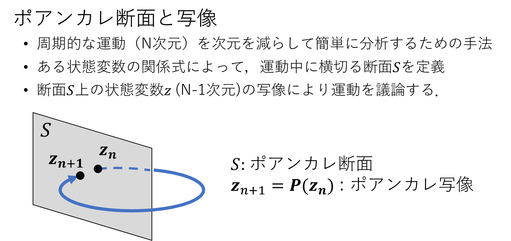
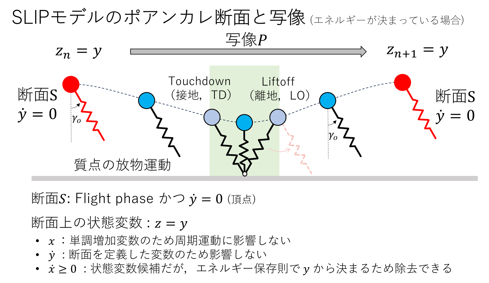

補足１　SLIPモデルの運動を分析しよう

# 注意事項
本資料は補足資料です，すべて応用課題になりますので，課題をすべて終えて余裕のある方だけやってください．難易度は高くなります．
詳細は[ReadMe](https://github.com/amby-1/sogoenshu_2023/blob/main/README.md)をよく読んで下さい．

# 補足１の目標
ここまでで作ってもらったSLIPモデルを用いて運動を分析する．
無限に繰り返す周期的な運動（周期解）をどうやって探し，かつその安定性（少しずらしても元の周期運動に戻るか）をどうやって判別するか？を考えるために，ポアンカレ断面と写像について学び，安定性の評価方法を理解します．また，ポアンカレ断面上での解の探索方法について，これまで学んだ非線形方程式の数値解法をもとに考えます．

# ポアンカレ断面とポアンカレ写像
前の資料で周期的なSLIPモデルの走行運動をシミュレーションしてもらったが，そもそも周期解になっているのかどうかの判別が厳密にできていなかった．また，解を探すのが非常に大変なことも肌で感じたと思う．

これら周期的な運動を簡単に分析する手段として，ポアンカレ断面とポアンカレ写像という概念が知られている．この資料では**厳密さは無視して**，簡単に概念を紹介する．（厳密な議論は参考文献を参照すること）

## ポアンカレ断面と写像の概念
$N$次元の状態空間においてシステムが運動する（微分方程式の解の流れが $N$次元空間内に存在）とする．この時に，ある状態変数の関係式を満たす $N-1$次元の超平面であるポアンカレ断面 $S$を取る．システムの解の流れが必ず断面 $S$を通るように断面を定義できれば，断面 $S$上の状態変数 $\boldsymbol{z}$の写像 $\boldsymbol P( \boldsymbol z)$によりシステムの運動を議論できる（模式図を以下に示す）．



このとき，システムの時間発展は写像を用いて以下のように表すことができ，
```math
\boldsymbol z_{n+1}  = \boldsymbol P (\boldsymbol z_n) 
```
周期解（1周期解）は以下の条件式で表すことができる．
```math
\boldsymbol z^*  = \boldsymbol P (\boldsymbol z^*) 
```
この $z^*$は不動点と呼ばれる．
一般に，この写像を解析的に求めることは困難であるため，本演習では数値的に写像を求めて分析する．

## 周期運動の線形安定性
一般に，周期解が与えられた時に，周期解に十分近いすべての点が周期解に収束するとき安定（漸近安定）であり，逆に，近傍のすべての点が周期解から離れていくとき不安定であるという．
この安定性は，対応するポアンカレ写像の不動点 $z^*$の安定性と密接に関係している．

ここでは，線形安定性の評価の仕方を説明する．
周期解 $z^*$にたいして微小に摂動 $\delta \boldsymbol z$を与えた時の時間発展は，以下のように１次までの線形近似することができる．
```math
\boldsymbol z^* + \delta \boldsymbol z_{n+1}  = \boldsymbol P (\boldsymbol z^* + \delta z_n) = \boldsymbol P(\boldsymbol z^*) + \left. \frac{ \partial \boldsymbol P }{\partial \boldsymbol z} \right|_{z = z^*} \delta \boldsymbol z_n
```
つまり，誤差の時間発展は以下で書ける
```math
\delta \boldsymbol z_{n+1}  = \left. \frac{ \partial \boldsymbol P }{\partial \boldsymbol z} \right|_{z^*} \delta \boldsymbol z_n =  \left( \left. \frac{ \partial \boldsymbol P }{\partial \boldsymbol z} \right|_{z^*} \right)^n \delta \boldsymbol z_1
```
なお，
```math
\frac{ \partial \boldsymbol P }{\partial \boldsymbol z} 
= 
\begin{bmatrix}
\frac{ \partial P_1}{\partial z_1} & \frac{ \partial P_1}{\partial z_2} & \cdots & \frac{ \partial P_1}{\partial z_{N-1}} \\
\frac{ \partial P_2}{\partial z_1} & \frac{ \partial P_2}{\partial z_2} & \cdots & \frac{ \partial P_2}{\partial z_{N-1}} \\
\vdots & \vdots &  \ddots & \vdots\\
\frac{ \partial P_{N-1}}{\partial z_1} & \frac{ \partial P_{N-1}}{\partial z_2} & \cdots & \frac{ \partial P_{N-1}}{\partial z_{N-1}} \\
\end{bmatrix}
```
であり，ヤコビ行列と呼ばれる．

このヤコビ行列のN-1個の固有値の最大の大きさが１未満であれば，周期解は漸近安定であることが分かる．最大の固有値の大きさが１より大きければ不安定である．
大きさが１の場合は，高次項（非線形）の影響が無視できないため安定性を判別できない．

>**Note**
>問1 上記の安定性判別方法について，１次元写像( $N-1 = 1$)の場合を考えて，固有値が１未満であれば，誤差が写像とともにゼロに漸近することを自分で確かめよ．また，固有値の大きさと収束速度の関係について考えよ，

# SLIPモデルにおけるポアンカレ断面と写像の定義
上記のポアンカレ断面と写像を，SLIPモデルについて定義する．SLIPモデルの状態変数は $(x, y, \dot{x}, \dot{y})$の４つであった．
この資料では，図のように

- Flight phase かつ  $\dot{y} = 0$ (質点が最大高さ（apex）に到達したタイミング)

のタイミングにおいて，ポアンカレ断面 $S$を定義する．



このとき，ポアンカレ断面における状態量は $z = y$ のみの１次元となる．$\dot{y}$ については，断面上では $\dot{y}=0$ のため考慮する必要がない． $x$ については，単調増加するだけであり周期運動に影響しないため省かれる．
 $\dot{x}$ については，断面上の状態変数となるはずだが，このシステムではエネルギーが保存するため，エネルギーの値が決まった場合に $y$から決定することができる（本資料では$\dot{x} \geq 0$の場合を考える）．
よって，系のエネルギーを決めた場合，ＳＬＩＰモデルの走行運動のポアンカレ写像は，断面上の $y$ を $z$ として，エネルギー $E$ に対して
```math
z_{n+1} = P_E(z_n) 
```
のように，１次元写像で書くことができ，周期解 $z^*$は $z^* = P_E(z^*)$を満たす．

安定性についても，スカラーのヤコビアン
```math
J = \left. \frac{\partial P_E}{\partial z} \right|_{z^*}
```
の大きさが１未満であるかどうかで評価できる．

この写像 $P_E$を解析的に求めることは困難なので，以下の演習では，数値的に写像を求め，周期解，安定性等を評価してもらう．

# 演習
順を追って，ポアンカレ写像を行う関数を計算して，周期解の探索と安定性の判別をしてみましょう．
この課題は応用課題なので，具体的にサンプルプログラム等は指定しません．各自で考えてやってみてください．

## ポアンカレ断面を判別し，状態変数の時間発展をプロットしてみる
まずは，これまで作ってもらったSLIPモデルのシミュレーションプログラムに，ポアンカレ断面を判別する部分を加えましょう．そして，各断面で $z$ の値をファイルに記録して，横軸断面，縦軸 $z$のグラフを作ってみてください．
平衡点や，収束しているか等が分かりやすくなると思います．

>**Warning**
>応用課題1 以下のパラメタの場合について，ポアンカレ断面での z の時間発展のグラフを作ってください．

- $dt = 0.0001$として，初期位置 $x = 0, y=1.05$ 初期速度 $\dot x = 6.455, \dot y = 0$，接地時角度 $\gamma_o = 0.54$ [rad], $T = 30$ [s]

## ポアンカレ写像をおこなう関数の作成
次に，ポアンカレ写像を計算する関数を作ってみましょう．例えば，最低限以下のパラメタを引数にして，１回分のポアンカレ写像を求めるプログラムを作ってみてください．
```c++
double z_next = map_poincare(double z_before)
```
なお，エネルギー $E$や $\gamma_0$ その他の物理パラメタ等は，クラスのメンバ変数（あるいはグローバル変数）等で別途指定することとしてください．

>**Warning**
>応用課題2 上記プログラムを作成し，問題なく写像を計算できていることを確かめてください．（応用課題１と結果を比較するなどして）

## 周期解の探索してみよう
さて，いよいよ周期解を探索します．これは，上記で実装してもらったポアンカレ写像を使って，
```math
z^* - P_E(z^*) = 0
```
を満たす， $z^*$を探す問題と同じです．
つまり，１次元の非線形方程式 $f(x)=0$の解を求める問題に帰着します．

このような非線形方程式の解の導出方法といて，Newton法を授業で習っています．
詳細は参考資料に譲りますが，概要は図のようなアルゴリズムでした．


なお，このNewton法を使うためには，関数 $f(x)$の微分を求める必要があります．
今回，この微分は解析的に計算できませんが， $f(x)$が数値計算できれば，以下のように１次近似して数値的に求めることができます．
```math
f'(x_a) = \frac{ f(x_a + \delta x) - f(x_a - \delta x) }{2 \delta x}
```

>**Warning**
> 応用課題3 以上の情報をもとに，周期解をNewton法で求めるプログラムを実装し，周期解を導出してみましょう．
> 例えば，応用課題１で収束した先の周期解を，この方法で導出してみてください．

>**Warning**
> 発展課題1 パラメタを変えれば，別の周期解が見つかるはずです．例えば， $\gamma_o$の値を上記で見つかった周期解のものから少し変えてみて，周期解を同様に探してみてください．
> 余裕があれば，横軸に $\gamma_o$，縦軸に $z$ を取って，見つかった周期解をプロットしてみて下さい．また，横軸に平均速度，縦軸に $\gamma_o$ や $z$ をプロットしてみて下さい．自分が早く走るときをイメージして，パラメタの傾向と比べてみて下さい．

## 安定性の判別をしてみよう
上記で求めた周期解について，数値的に安定性を導出してみてください．
微分の計算方法は，前の課題と似た方法で計算できます．

>**Warning**
> 応用課題4 応用課題１で収束した先の周期解の安定性を，この方法で導出してみてください．

>**Warning**
> 発展課題2 発展課題１で見つけた周期解について，安定性を調べて，最大固有値の変化をグラフにしてみてください．どういうときに安定で，どういうときに不安定な傾向があるでしょうか？

これらの結果のように，システムには安定に走ることが可能な解が存在することが分かります．
これらの解をベースにしてロボットの運動を作れば，エネルギー少なく（保存系の運動なので，アクチュエータはあまり仕事をせずに再現できることが期待される），安定（外乱があってもこけない）な運動が実現できそうなことが予想できると思います．

# 参考資料
- C＋＋言語に関する資料等
  - WEBサイト https://programming.pc-note.net/cpp/class2.html
- 数値計算法に関する資料等
  - WEBサイト「東京大学工学部 精密工学科 プログラミング応用 I・ II」 http://www.den.t.u-tokyo.ac.jp/ad_prog/ode/
- SLIPモデルに関する資料等
  - [Maziar A. Sharbafi and André Seyfarth, "Bioinspired Legged Locomotion, Models, Concepts, Control and Applications", 2017 Elsevier Inc., Chapter 3.](https://www.sciencedirect.com/book/9780128037669/bioinspired-legged-locomotion)
- ポアンカレ断面等，力学系に関する資料
  - [ストロガッツ，「非線形ダイナミクスとカオス」，丸善出版](https://www.maruzen-publishing.co.jp/item/b294857.html)
- ニュートン法に関する資料
  - WEBサイト 「群馬大学講義資料　数値計算」 http://polymer.chem-bio.st.gunma-u.ac.jp/houteisiki(theory).pdf
